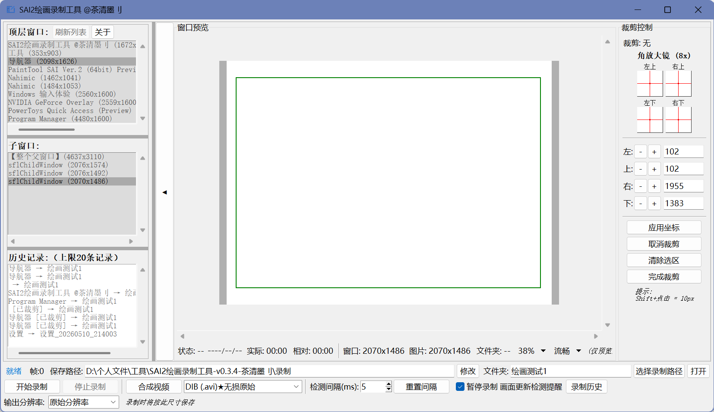
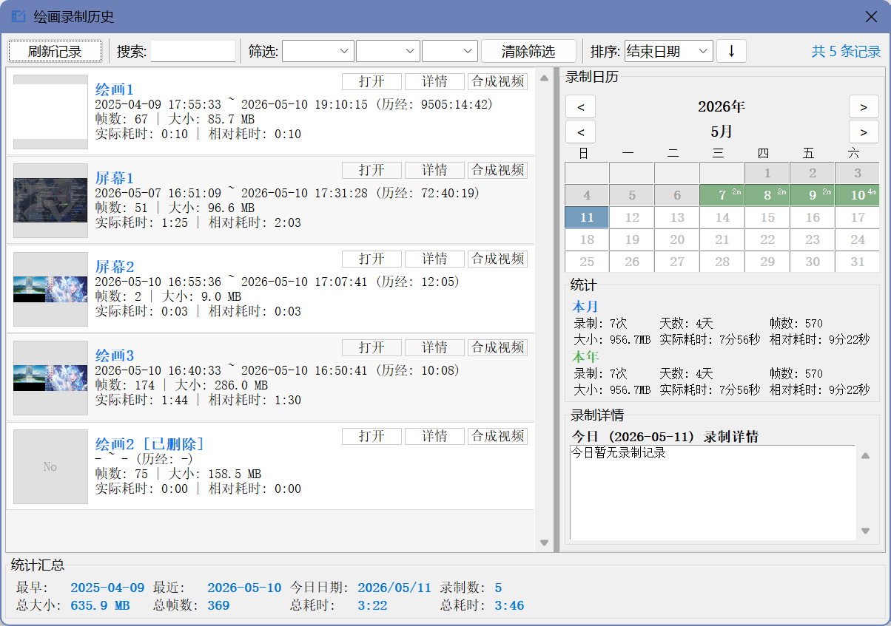

# SAI2-DrawingRecordingTool-绘画录制工具
支持任意SAI2版本以及任意绘画软件；Supports any version of SAI2 and any painting software

Bilibili视频Video：[【推荐】SAI2绘画录制工具](https://www.bilibili.com/video/BV16J576WE8t)
# 作者：[茶清墨刂](https://space.bilibili.com/388428308) & DeepSeek & Trae

[GitHub资源页&更新说明](https://github.com/TeaClearInkII/SAI2-DrawingRecordingTool/releases)

[123云盘](https://1818650178.share.123865.com/123pan/gjihjv-NfVad)

[GitHub仓库](https://github.com/TeaClearInkII/SAI2-DrawingRecordingTool)

[反馈](https://github.com/TeaClearInkII/SAI2-DrawingRecordingTool/issues)

# 捐赠&支持-Donations&Support
⚡[爱发电](https://ifdian.net/a/TeaClearInkII)

# 界面展示

# 使用说明

！！！请不要将录制窗口最小化！！！

1. "其它"→"设置"→"首选项"→"导航器"设置分辨率4096、隐藏参考线

2. 在SAI2界面上找到"窗口"→"分离操作面板"→"分离导航器"

3. 将导航器拉伸到画布合适大小

4. 软件中选中导航器并裁剪合适大小

5. 将导航器放到边边角角上不影响观看画面

【功能介绍】
- 窗口选择：支持选择主窗口和子窗口（导航器）进行录制
- 录制控制：开始录制 / 暂停录制 / 继续录制 / 停止录制
- 区域裁剪：支持角放大镜定位、键盘方向键微调裁剪区域
- 视频合成：支持 XVID/MJPG/DIB/DIVX/mp4v 编码器，内置 FFmpeg
- 历史管理：录制历史窗口，支持日历视图和统计汇总
- 分辨率缩放：原始分辨率 / 百分比缩放 / 固定宽度输出
- 配置记忆：自动记住窗口选择和裁剪配置

【录制特点】
- 智能去重：基于感知哈希算法，只保存画面变化的帧
- 操作触发：检测鼠标按键抬起时自动截图，精准捕捉绘画动作
- 双时统计：分别统计实际绘画时间和总录制时间
- 高效存储：无冗余帧，文件体积小
- 恢复录制：可在已有录制后继续追加新帧

【合成视频编码器】
- FFmpeg H.264 ★最佳：压缩率最高，兼容性最好
- XVID(.avi) ★推荐：兼容性极佳，系统播放器直接播放
- MJPG(.avi)：高兼容性，画质好，文件较大
- DIB(.avi) 无损：未压缩原始视频，100%兼容，文件很大
- DIVX(.avi)：兼容较老设备
- mp4v(.mp4)：MPEG-4编码，需第三方播放器

【保存位置】
- 保存路径可自定义，文件夹名可自定义
- 工具会自动记住上次使用的路径
- 录制信息保存为 recording_info.json

【运行环境】
- Windows 7 或更高版本
- 无需安装 Python 或任何依赖（已打包为单文件）

【第三方开源组件许可证】
本软件使用了以下开源组件：
- FFmpeg：LGPL 2.1+ 开源许可证
  官网：https://ffmpeg.org/
  本软件内置的 FFmpeg 用于视频编码功能。
  根据 LGPL 许可证要求，FFmpeg 的源代码可在上述官网获取。
  本软件用户有权在使用本软件的同时：
  · 获得 FFmpeg 的源代码
  · 修改 FFmpeg 以满足个性化需求
  · 重发布 FFmpeg（需遵循 LGPL 条款）
  LGPL 详情请参阅：https://ffmpeg.cpp.org.cn/legal.html
